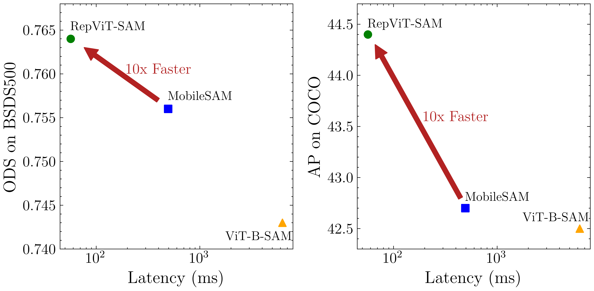

# [RepViT-SAM: Towards Real-Time Segmenting Anything](https://arxiv.org/abs/2312.05760)

Official PyTorch implementation of **RepViT-SAM**, from the following paper:

[RepViT-SAM: Towards Real-Time Segmenting Anything](https://arxiv.org/abs/2312.05760).\
Ao Wang, Hui Chen, Zijia Lin, Jungong Han, and Guiguang Ding\
[[`arXiv`](https://arxiv.org/abs/2312.05760)]

<p align="center">
   <br>
  Models are deployed on iPhone 12 with Core ML Tools to get latency.
</p>

<details>
  <summary>
  <font size="+1">Abstract</font>
  </summary>
Segment Anything Model (SAM) has shown impressive zero-shot transfer performance for various computer vision tasks recently. However, its heavy computation costs remain daunting for practical applications. MobileSAM proposes to replace the heavyweight image encoder in SAM with TinyViT by employing distillation, which results in a significant reduction in computational requirements. However, its deployment on resource-constrained mobile devices still encounters challenges due to the substantial memory and computational overhead caused by self-attention mechanisms. Recently, RepViT achieves the state-of-the-art performance and latency trade-off on mobile devices by incorporating efficient architectural designs of ViTs into CNNs. Here, to achieve real-time segmenting anything on mobile devices, following, we replace the heavyweight image encoder in SAM with RepViT model, ending up with the RepViT-SAM model. Extensive experiments show that RepViT-SAM can enjoy significantly better zero-shot transfer capability than MobileSAM, along with nearly $10\times$ faster inference speed.
</details>

<br/>

## Installation
```bash
pip install -e .
# download pretrained checkpoint
mkdir weights && cd weights
wget https://github.com/THU-MIG/RepViT/releases/download/v1.0/repvit_sam.pt
```

## Demo
Our Hugging Face demo is [here](https://huggingface.co/spaces/jameslahm/repvit-sam)
```
python app/app.py
```

## CoreML export
Please refer to [coreml_example.ipynb](./notebooks/coreml_example.ipynb)


## Latency comparisons
Comparison between RepViT-SAM and others in terms of latency. The latency (ms) is measured with the standard resolution of 1024 $\times$ 1024 on iPhone 12 and Macbook M1 Pro by Core ML Tools. OOM means out of memory.

<table class="tg">
<thead>
  <tr>
    <th class="tg-c3ow" rowspan="2">Platform</th>
    <th class="tg-c3ow" colspan="3">Image encoder</th>
    <th class="tg-c3ow" rowspan="2">Mask decoder</th>
  </tr>
  <tr>
    <th class="tg-c3ow" rowspan="1">RepViT-SAM</th>
    <th class="tg-c3ow" rowspan="1">MobileSAM</th>
    <th class="tg-c3ow" rowspan="1">ViT-B-SAM</th>
  </tr>
</thead>
<tbody>
  <tr>
    <td class="tg-c3ow">iPhone</td>
    <td class="tg-c3ow"><b>48.9ms</b></td>
    <td class="tg-c3ow">OOM</td>
    <td class="tg-c3ow">OOM</td>
    <td class="tg-c3ow">11.6ms</td>
  </tr>
  <tr>
    <td class="tg-c3ow">Macbook</td>
    <td class="tg-c3ow"><b>44.8ms</b></td>
    <td class="tg-c3ow">482.2ms</td>
    <td class="tg-c3ow">6249.5ms</td>
    <td class="tg-c3ow">11.8ms</td>
  </tr>
</tbody>
</table>


## Zero-shot edge detection

Comparison results on BSDS500.

<table class="tg">
<thead>
  <tr>
    <th class="tg-c3ow" rowspan="2">Model</th>
    <th class="tg-c3ow" colspan="3">zero-shot edge detection</th>
  </tr>
  <tr>
    <th class="tg-c3ow">ODS</th>
    <th class="tg-c3ow">OIS</th>
    <th class="tg-c3ow">AP</th>
  </tr>
</thead>
<tbody>
  <tr>
    <td class="tg-c3ow">ViT-H-SAM</td>
    <td class="tg-c3ow"><b>.768</b></td>
    <td class="tg-c3ow"><b>.786</b></td>
    <td class="tg-c3ow"><b>.794</b></td>
  </tr>
  <tr>
    <td class="tg-c3ow">ViT-B-SAM</td>
    <td class="tg-c3ow">.743</td>
    <td class="tg-c3ow">.764</td>
    <td class="tg-c3ow">.726</td>
  </tr>
  <tr>
    <td class="tg-c3ow">MobileSAM</td>
    <td class="tg-c3ow">.756</td>
    <td class="tg-c3ow">.768</td>
    <td class="tg-c3ow">.746</td>
  </tr>
  <tr>
    <td class="tg-c3ow">RepViT-SAM</td>
    <td class="tg-c3ow"><ins>.764</ins></td>
    <td class="tg-c3ow"><ins>.786</ins></td>
    <td class="tg-c3ow"><ins>.773</ins></td>
  </tr>
</tbody>
</table>


## Zero-shot instance segmentation and SegInW
Comparison results on COCO and SegInW.

<table class="tg">
<thead>
  <tr>
    <th class="tg-c3ow" rowspan="2">Model</th>
    <th class="tg-c3ow" colspan="4">zero-shot instance segmentation</th>
    <th class="tg-c3ow">SegInW</th>
  </tr>
  <tr>
    <th class="tg-c3ow">AP</th>
    <th class="tg-c3ow">$AP^{S}$</th>
    <th class="tg-c3ow">$AP^{M}$</th>
    <th class="tg-c3ow">$AP^{L}$</th>
    <th class="tg-c3ow">Mean AP</th>
  </tr>
</thead>
<tbody>
  <tr>
    <td class="tg-c3ow">ViT-H-SAM</td>
    <td class="tg-c3ow"><b>46.8</b></td>
    <td class="tg-c3ow"><b>31.8</b></td>
    <td class="tg-c3ow"><b>51.0</b></td>
    <td class="tg-c3ow"><b>63.6</b></td>
    <td class="tg-c3ow"><b>48.7</b></td>
  </tr>
  <tr>
    <td class="tg-c3ow">ViT-B-SAM</td>
    <td class="tg-c3ow">42.5</td>
    <td class="tg-c3ow"><ins>29.8</ins></td>
    <td class="tg-c3ow">47.0</td>
    <td class="tg-c3ow">56.8</td>
    <td class="tg-c3ow">44.8</td>
  </tr>
  <tr>
    <td class="tg-c3ow">MobileSAM</td>
    <td class="tg-c3ow">42.7</td>
    <td class="tg-c3ow">27.0</td>
    <td class="tg-c3ow">46.5</td>
    <td class="tg-c3ow">61.1</td>
    <td class="tg-c3ow">43.9</td>
  </tr>
  <tr>
    <td class="tg-c3ow">RepViT-SAM</td>
    <td class="tg-c3ow"><ins>44.4</ins></td>
    <td class="tg-c3ow">29.1</td>
    <td class="tg-c3ow"><ins>48.6</ins></td>
    <td class="tg-c3ow"><ins>61.4</ins></td>
    <td class="tg-c3ow"><ins>46.1</ins></td>
  </tr>
</tbody>
</table>

## Zero-shot video object/instance segmentation
Comparison results on DAVIS 2017 and UVO.

<table class="tg">
<thead>
  <tr>
    <th class="tg-c3ow" rowspan="2">Model</th>
    <th class="tg-c3ow" colspan="3">z.s. VOS</th>
    <th class="tg-c3ow">z.s. VIS</th>
  </tr>
  <tr>
    <th class="tg-c3ow">$\mathcal{J\&amp;F}$</th>
    <th class="tg-c3ow">$\mathcal{J}$</th>
    <th class="tg-c3ow">$\mathcal{F}$</th>
    <th class="tg-c3ow">AR100</th>
  </tr>
</thead>
<tbody>
  <tr>
    <td class="tg-c3ow">ViT-H-SAM</td>
    <td class="tg-c3ow"><b>77.4</b></td>
    <td class="tg-c3ow"><b>74.6</b></td>
    <td class="tg-c3ow"><b>80.2</b></td>
    <td class="tg-c3ow"><b>28.8</b></td>
  </tr>
  <tr>
    <td class="tg-c3ow">ViT-B-SAM</td>
    <td class="tg-c3ow">71.3</td>
    <td class="tg-c3ow">68.5</td>
    <td class="tg-c3ow">74.1</td>
    <td class="tg-c3ow">19.1</td>
  </tr>
  <tr>
    <td class="tg-c3ow">MobileSAM</td>
    <td class="tg-c3ow">71.1</td>
    <td class="tg-c3ow">68.6</td>
    <td class="tg-c3ow">73.6</td>
    <td class="tg-c3ow">22.7</td>
  </tr>
  <tr>
    <td class="tg-c3ow">RepViT-SAM</td>
    <td class="tg-c3ow"><ins>73.5</ins></td>
    <td class="tg-c3ow"><ins>71.0</ins></td>
    <td class="tg-c3ow"><ins>76.1</ins></td>
    <td class="tg-c3ow"><ins>25.3</ins></td>
  </tr>
</tbody>
</table>

## Zero-shot salient object segmentation
Comparison results on DUTS.
## Zero-shot anomaly detection
Comparison results on MVTec.
<table class="tg">
<thead>
  <tr>
    <th class="tg-c3ow" rowspan="2">Model</th>
    <th class="tg-c3ow">z.s. s.o.s.</th>
    <th class="tg-c3ow">z.s. a.d.</th>
  </tr>
  <tr>
    <th class="tg-c3ow">$\mathcal{M}$ $\downarrow$</th>
    <th class="tg-c3ow">$\mathcal{F}_{p}$</th>
  </tr>
</thead>
<tbody>
  <tr>
    <td class="tg-c3ow">ViT-H-SAM</td>
    <td class="tg-c3ow"><b>0.046</b></td>
    <td class="tg-c3ow"><ins>37.65</ins></td>
  </tr>
  <tr>
    <td class="tg-c3ow">ViT-B-SAM</td>
    <td class="tg-c3ow">0.121</td>
    <td class="tg-c3ow">36.62</td>
  </tr>
  <tr>
    <td class="tg-c3ow">MobileSAM</td>
    <td class="tg-c3ow">0.147</td>
    <td class="tg-c3ow">36.44</td>
  </tr>
  <tr>
    <td class="tg-c3ow">RepViT-SAM</td>
    <td class="tg-c3ow"><ins>0.066</ins></td>
    <td class="tg-c3ow"><b>37.96</b></td>
  </tr>
</tbody>
</table>

## Acknowledgement

The code base is partly built with [SAM](https://github.com/facebookresearch/segment-anything) and [MobileSAM](https://github.com/ChaoningZhang/MobileSAM). 

Thanks for the great implementations! 

## Citation

If our code or models help your work, please cite our paper:
```BibTeX
@misc{wang2023repvitsam,
      title={RepViT-SAM: Towards Real-Time Segmenting Anything}, 
      author={Ao Wang and Hui Chen and Zijia Lin and Jungong Han and Guiguang Ding},
      year={2023},
      eprint={2312.05760},
      archivePrefix={arXiv},
      primaryClass={cs.CV}
}
```
